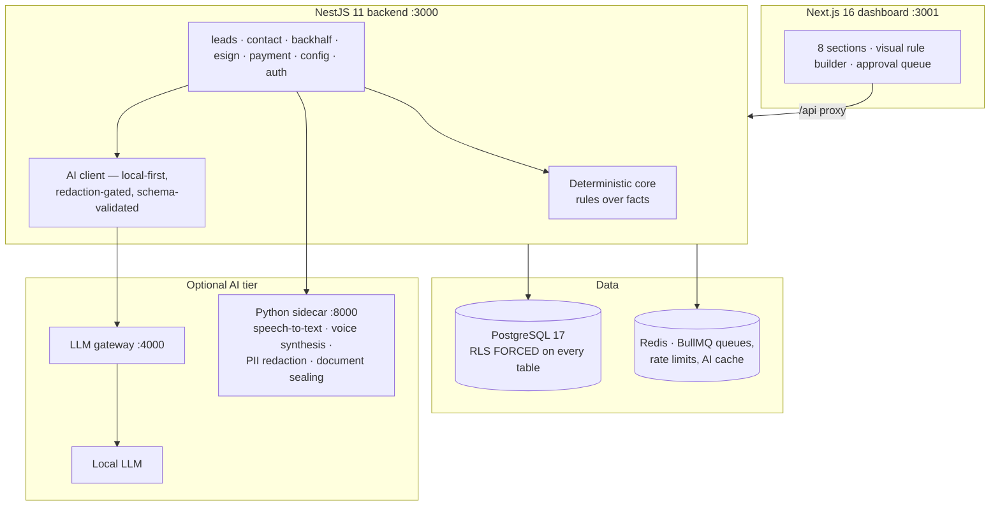

# Deal Engine — an autonomous B2B sales pipeline engine

**I designed and built a complete, production-grade deal automation platform
as my internship capstone at Sprout Solutions (Revenue Operations):** a
system that takes a sales lead from first touch to a signed, paid,
handed-off deal — scoring, routing, drafting, chasing, e-signing and
collecting — with a human one-tap approval in front of every outbound step.

> The source code is private under my internship's IP agreement. This page
> documents the architecture and engineering — and
> **[STRUCTURE.md](STRUCTURE.md) shows the shape and scale of the private
> codebase**. I'm happy to give a live walkthrough or demo on request.

---

## What it does

```mermaid
flowchart LR
  A[Lead in<br/>CSV · manual · API] --> B[Score & tier<br/>rules over facts]
  B --> C[Route first contact<br/>email / Viber voice / wait]
  C --> D[Draft + one-tap approve<br/>AI or template]
  D --> E[Call recap<br/>on-device Whisper]
  E --> F[Proposal + PDF<br/>pricing gates]
  F --> G[Follow-up cadences &<br/>stakeholder chasing]
  G --> H[E-sign<br/>hash-sealed, verifiable]
  H --> I[Payment + QR Ph]
  I --> J[Onboarding handoff]
```

Every step is governed by an **autonomy dial**: each stage runs as *Draft*
(generate, then wait for a human tap — the default) or *Auto* (dispatch
immediately), per workspace, editable live. Teams grant the machine autonomy
step-by-step as its drafts earn trust.

Built deliberately for the **Philippine sales motion**: Viber voice-note
outreach, Taglish-capable on-device call transcription, self-hosted
e-signatures aligned with RA 8792 (the PH E-Commerce Act), scan-to-pay
**QR Ph** payment pages, and Data-Privacy-Act-aware consent tracking on
every contact.

## The design principle: rules decide, AI only writes

The core is a **deterministic rules engine** running user-editable rules
over named facts — fit scoring, engagement decay, tiering, channel routing,
proposal gates. Sales teams edit the rules, weights, templates and cadences
in a visual dashboard editor (no code, no deploy); the same facts always
produce the same decision, and a built-in dry-run panel answers "why did
this lead score 90?" by naming the exact rules that fired.

AI is deliberately fenced in: it only drafts language and transcribes audio.
It is **local-first** (an on-device model by default), optional (a
kill-switch drops the whole system to template mode — and a test gate proves
the pipeline still advances), schema-validated (malformed model output is
rejected, never half-trusted), **PII-redacted before any cloud call** (a
redaction firewall with custom recognizers for Philippine identifiers
replaces personal data with placeholders and re-inserts it locally),
prompt-injection-defended, and metered in an append-only usage ledger. The
entire platform runs at **₱0 in licences and cloud costs** on one laptop.

## Architecture

**Multi-tenancy enforced by the database, not the app:** every table carries
a tenant id with PostgreSQL Row-Level Security enabled **and forced**, and
the app connects as a non-superuser role — so even a buggy query physically
cannot read another workspace's rows. The tenant identity comes only from a
verified JWT; no client-supplied value can name a tenant. A dedicated e2e
gate runs as the real runtime role to prove it on every push.

**Security engineering throughout:** enumeration-safe hardened
authentication, distributed rate limiting across the whole public surface,
upload content verification, single-use expiring tokens on every public
link, credentials encrypted at rest and never returned by the API, and
append-only audit tables enforced at the database-privilege level.

**Self-hosted e-signature:** proposals render to PDFs, signers get
tokenized public pages, and sealed documents carry a cryptographic
integrity verdict — alter a single byte and verification reports TAMPERED.
A public buyer "deal room" gives customers a read-only view of their deal's
progress, documents and payment QR, on an expiring tokenized link.

## Engineering discipline

Six **always-green test gates** encode the non-negotiables: tenant
isolation (run as the real runtime DB role), the PII redaction boundary,
deterministic scoring, the AI-off guarantee, e-sign tamper evidence, and
one-command wiring — enforced locally and by CI on every push, alongside
dependency audits and SBOM generation. The whole stack reproduces from a
fresh clone with two commands (`bootstrap.sh` → `launch.sh`), verified
end-to-end: a 20-step headless demo drives the entire lifecycle against the
live API and prints evidence per step.

## Watch it prove itself

Real output, not mockups — `demo:run` driving all twenty lifecycle steps
through the public API of a live local stack. Every id, seal hash and
tamper verdict below came from an actual run:

…followed by the full gate suite — 306 unit tests, then the three e2e gate
suites, including tenant isolation executed as the real runtime database
role:

## By the numbers

| | |
|---|---|
| TypeScript | ~30,000 lines across a NestJS 11 API + Next.js 16 dashboard |
| API surface | 82 REST endpoints across 14 modules |
| Data model | 20 tables, 21 migrations, RLS forced everywhere |
| Tests | 306 unit + 29 e2e, including the six architectural gates |
| Dashboard | 12 routes: pipeline, deal journeys, approval queue, visual rule builder, score dry-run lab, template/cadence editors, BYO-key integrations, live health |
| AI tier | local LLM drafting, on-device Whisper transcription, TTS voice notes, PII redaction firewall, PDF sealing — all optional by design |
| Running cost | ₱0 — local-first architecture, BYO keys for optional cloud |

## Stack

TypeScript · NestJS · Next.js · React · PostgreSQL (row-level security) ·
Redis · Docker · Python/FastAPI · local LLM inference · GitHub Actions CI

---

**Ethan Owen Taruc** — built end-to-end (research, product design,
architecture, implementation, tests, documentation) as the final project of
my Revenue Operations internship at Sprout Solutions, on a pipeline-
automation concept proposed by my mentor. Source is private under the
internship IP agreement; live demo gladly arranged.
